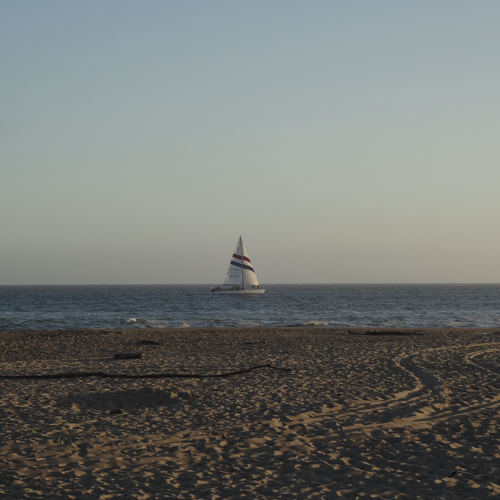
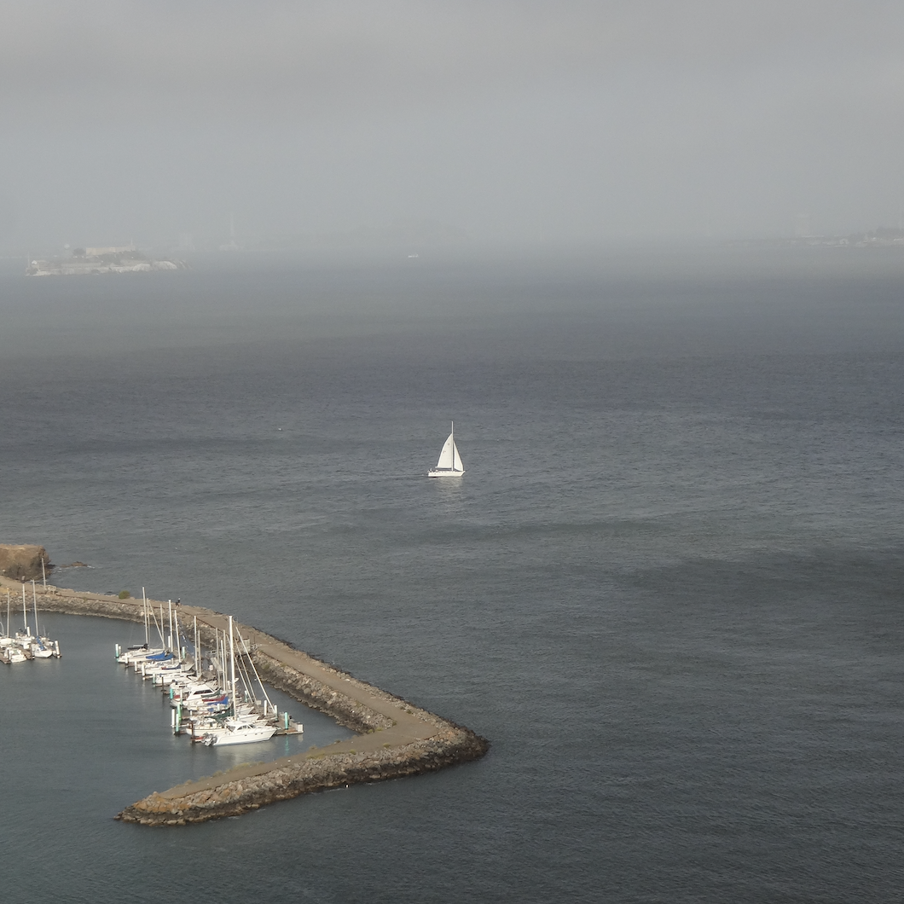
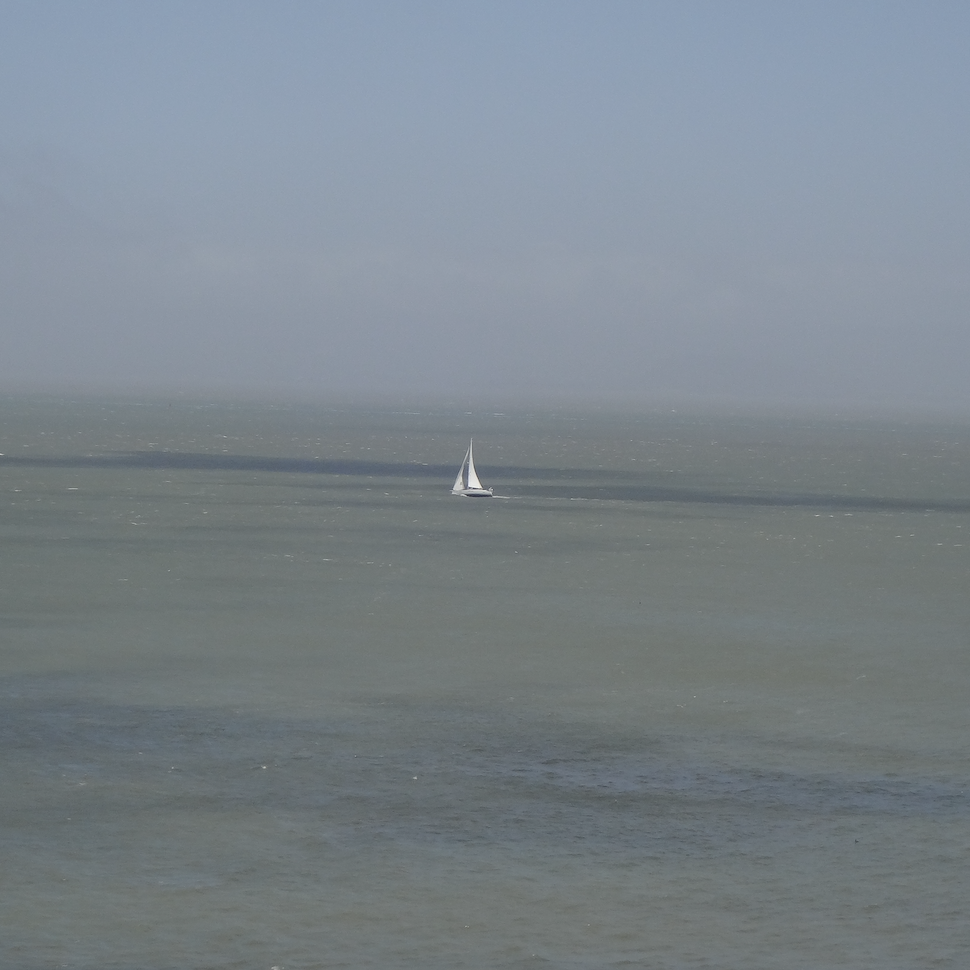
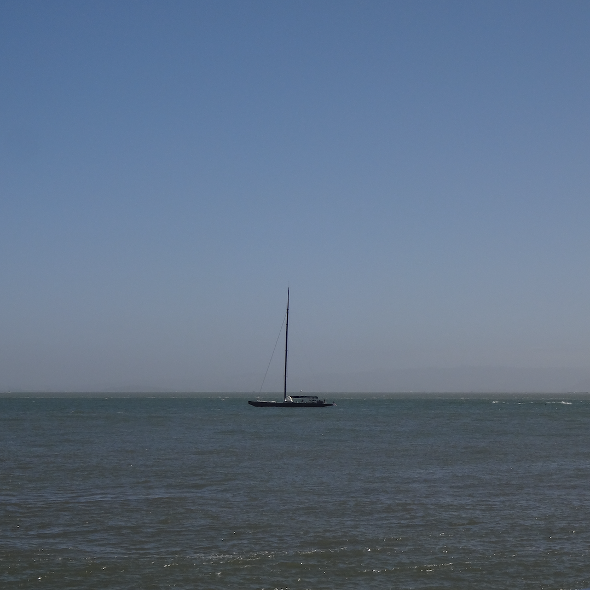
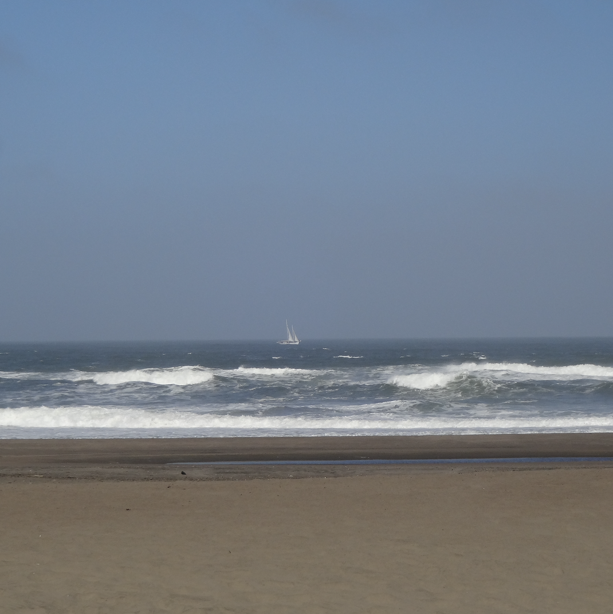
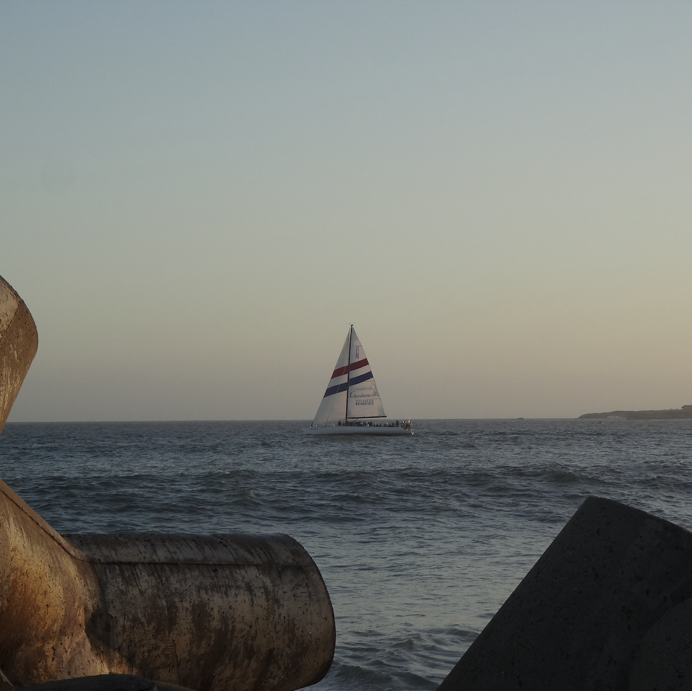

  
  
  
  
  
  

Little Boats was a creative project in which I explored the Bay Area of California to capture photos of sailboats in the middle of large bodies of water. The goal was to document the elegance of boats against the region’s natural beauty, including the open waters, bright skies, and iconic coasts. 

As the photographer and planner of this project, I was responsible for finding different locations, choosing the best settings for optimal lighting, and framing shots that best portrayed the sailboats. In addition to capturing photos, I also worked on post-processing techniques to enhance the colors and contrast of the final photos. This project required patience as I often had to wait for the moment when the boats were positioned perfectly within the frame.

Through this experience, I developed my understanding of photography techniques. More than this, the project showed me the importance of persistence and creativity. It was an experience that combined my love for exploration with my passion for photography.

